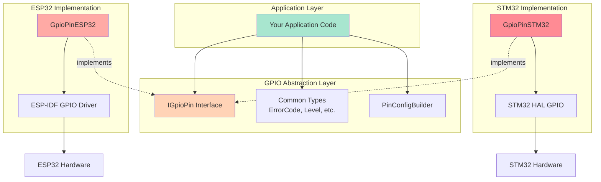

# GPIO Abstraction Layer - Design Philosophy

## The Problem

You correctly identified that both ESP-IDF and STM32 HAL are already quite close to the application layer. So why create another abstraction?

The key insight is that **vendor HALs optimize for feature completeness, not for portability**.

## The Breakthrough Idea

Instead of creating a "wrapper" around vendor APIs, this design creates a **new mental model** for GPIO operations:

### 1. **Pin-Centric Instead of Register-Centric**

**Traditional Approach (ESP-IDF):**
```cpp
gpio_config_t io_conf = {};
io_conf.pin_bit_mask = (1ULL << GPIO_NUM_2);
io_conf.mode = GPIO_MODE_OUTPUT;
io_conf.pull_up_en = GPIO_PULLUP_DISABLE;
gpio_config(&io_conf);
gpio_set_level(GPIO_NUM_2, 1);
```

**Traditional Approach (STM32 HAL):**
```cpp
GPIO_InitTypeDef gpio_init = {};
gpio_init.Pin = GPIO_PIN_5;
gpio_init.Mode = GPIO_MODE_OUTPUT_PP;
HAL_GPIO_Init(GPIOA, &gpio_init);
HAL_GPIO_WritePin(GPIOA, GPIO_PIN_5, GPIO_PIN_SET);
```

**Our Abstraction (Both platforms):**
```cpp
GpioPin led(PIN_NUMBER);
auto config = PinConfigBuilder().as_output(Level::LOW).build();
led.init(config);
led.set_level(Level::HIGH);
// Automatic cleanup via RAII
```

### 2. **Object Lifetime = Resource Lifetime (RAII)**

Vendor HALs require manual deinit:
```cpp
// ESP-IDF: Must remember to reset
gpio_reset_pin(pin_num);

// STM32: Must remember to deinit
HAL_GPIO_DeInit(port, pin);
```

Our abstraction uses C++ destructors:
```cpp
{
    GpioPin led(PIN);
    led.init(config);
    // Use the pin...
} // Automatically deinitialized here!
```

### 3. **Type Safety Through Builder Pattern**

Vendor HALs use error-prone structs:
```cpp
// Easy to make mistakes - these are just integers!
io_conf.pull_up_en = 2;  // Invalid value, but compiles!
io_conf.mode = 99;       // Invalid mode, but compiles!
```

Our abstraction uses type-safe enums:
```cpp
// Compile-time safety
.pull(Pull::UP)                    // ✅ Valid
.pull(2)                          // ❌ Compile error
.direction(Direction::OUTPUT)     // ✅ Valid
.direction(99)                    // ❌ Compile error
```

### 4. **Explicit Error Handling**

Vendor HALs often use different error conventions:
```cpp
// ESP-IDF: Returns esp_err_t
esp_err_t err = gpio_config(&conf);

// STM32: Often returns HAL_StatusTypeDef
HAL_StatusTypeDef status = HAL_GPIO_Init(port, &init);
```

Our abstraction uses unified error codes:
```cpp
ErrorCode err = pin.init(config);
if (err != ErrorCode::OK) {
    // Handle error uniformly across platforms
}
```

### 5. **Testability Through Interfaces**

Vendor HALs are hard to mock:
```cpp
// How do you unit test this without hardware?
gpio_set_level(GPIO_NUM_2, 1);
```

Our abstraction uses interfaces:
```cpp
// Easy to create mock implementations for testing
class MockGpioPin : public IGpioPin {
    ErrorCode set_level(Level level) override {
        // Record the call for verification
        last_level = level;
        return ErrorCode::OK;
    }
};
```

## Why This Approach is "Breakthrough"

### ⚡ It's Not Just Translation
Most HAL wrappers just translate function names. This design **changes how you think** about GPIO:
- From "configure registers" to "create pin objects"
- From "manual resource management" to "automatic cleanup"
- From "magic numbers" to "typed enums"
- From "different APIs per platform" to "unified mental model"

### ⚡ It Adds Value, Not Just Indirection
- **RAII**: Prevents resource leaks
- **Builder**: Makes configuration readable and correct
- **Type safety**: Catches errors at compile time
- **Testability**: Enables unit testing without hardware

### ⚡ It Stays Close to Hardware
Despite the abstraction, you can still:
- Access the raw pin number
- Use platform-specific extensions when needed
- Have zero runtime overhead (inline methods, compile-time optimization)

## Architecture Diagram



## Comparison with Direct HAL Usage

| Aspect | Direct HAL | Our Abstraction |
|--------|-----------|-----------------|
| **Portability** | Requires rewrite per platform | Write once, run everywhere |
| **Resource Safety** | Manual init/deinit | Automatic via RAII |
| **Type Safety** | Integer literals, easy to misuse | Strong types, compile-time checks |
| **Readability** | Verbose struct initialization | Fluent builder pattern |
| **Testability** | Requires hardware or complex mocking | Interface-based mocking |
| **Error Handling** | Platform-specific error types | Unified ErrorCode enum |
| **Learning Curve** | Must learn each vendor API | Learn once, use everywhere |
| **Performance** | Optimal (direct HAL calls) | Optimal (inlines to same code) |

## When NOT to Use This Abstraction

This abstraction is designed for **portable application code**. Don't use it if:

1. **You need platform-specific features** that don't map across targets
   - Example: ESP32's GPIO matrix routing
   - Solution: Use extension APIs or access vendor HAL directly

2. **You're writing a low-level driver** that must be platform-specific anyway
   - Example: SPI bitbang implementation
   - Solution: Use vendor HAL directly

3. **You need absolute minimal code size**
   - The abstraction adds minimal overhead, but direct HAL is still slightly smaller
   - Solution: Use vendor HAL for size-critical applications

## Summary

This GPIO abstraction is "breakthrough" because it:

1. **Shifts the mental model** from register manipulation to object-oriented pin management
2. **Adds real safety** through RAII and type checking
3. **Improves developer experience** with builder pattern and unified APIs
4. **Enables testing** through interface-based design
5. **Has zero runtime cost** due to C++ inline optimization

It's not just a wrapper—it's a **better way to think about GPIO** that happens to be portable.
