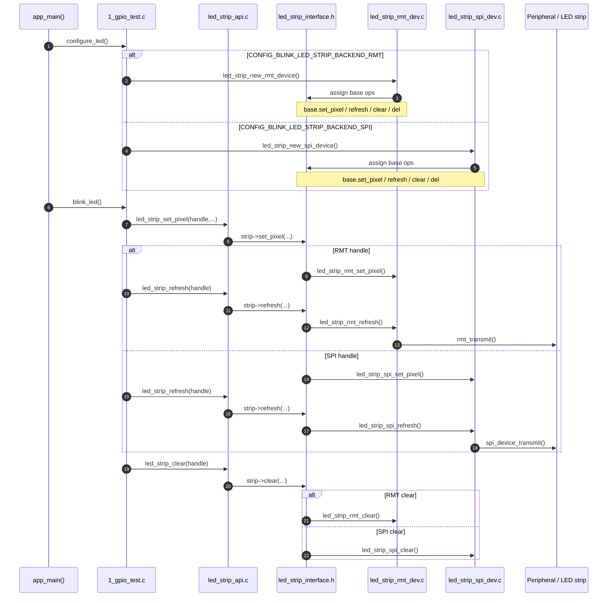

```mermaid
sequenceDiagram
    autonumber
    participant App as app_main()
    participant AppCode as 1_gpio_test.c
    participant API as led_strip_api.c
    participant Iface as led_strip_interface.h
    participant RMT as led_strip_rmt_dev.c
    participant SPI as led_strip_spi_dev.c
    participant HW as Peripheral / LED strip

    App->>AppCode: configure_led()
    alt CONFIG_BLINK_LED_STRIP_BACKEND_RMT
        AppCode->>RMT: led_strip_new_rmt_device()
        RMT->>Iface: assign base ops
        Note over RMT,Iface: base.set_pixel / refresh / clear / del
    else CONFIG_BLINK_LED_STRIP_BACKEND_SPI
        AppCode->>SPI: led_strip_new_spi_device()
        SPI->>Iface: assign base ops
        Note over SPI,Iface: base.set_pixel / refresh / clear / del
    end

    App->>AppCode: blink_led()
    AppCode->>API: led_strip_set_pixel(handle,...)
    API->>Iface: strip->set_pixel(...)
    alt RMT handle
        Iface->>RMT: led_strip_rmt_set_pixel()
        AppCode->>API: led_strip_refresh(handle)
        API->>Iface: strip->refresh(...)
        Iface->>RMT: led_strip_rmt_refresh()
        RMT->>HW: rmt_transmit()
    else SPI handle
        Iface->>SPI: led_strip_spi_set_pixel()
        AppCode->>API: led_strip_refresh(handle)
        API->>Iface: strip->refresh(...)
        Iface->>SPI: led_strip_spi_refresh()
        SPI->>HW: spi_device_transmit()
    end

    AppCode->>API: led_strip_clear(handle)
    API->>Iface: strip->clear(...)
    alt RMT clear
        Iface->>RMT: led_strip_rmt_clear()
    else SPI clear
        Iface->>SPI: led_strip_spi_clear()
    end
```

