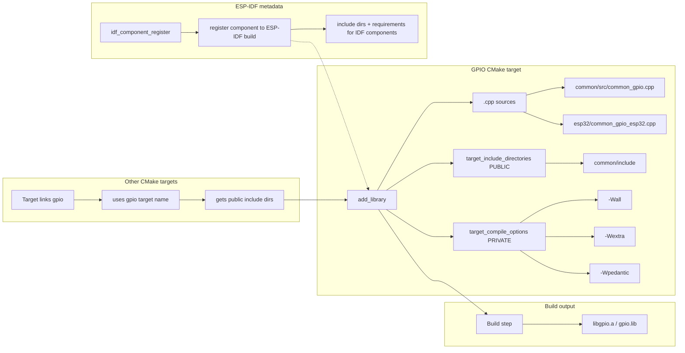

```mermaid
flowchart LR
    subgraph Library [GPIO CMake target]
        A[add_library] --> B[.cpp sources]
        B --> B1[common/src/common_gpio.cpp]
        B --> B2[esp32/common_gpio_esp32.cpp]
        A --> C[target_include_directories PUBLIC]
        C --> C1[common/include]
        A --> D[target_compile_options PRIVATE]
        D --> D1[-Wall]
        D --> D2[-Wextra]
        D --> D3[-Wpedantic]
    end

    subgraph Consumers [Other CMake targets]
        E[Target links gpio] --> F[uses gpio target name]
        F --> G[gets public include dirs]
    end

    subgraph Build [Build output]
        H[Build step] --> I[libgpio.a / gpio.lib]
    end

    subgraph ESPIDF [ESP-IDF metadata]
        J[idf_component_register] --> K[register component to ESP-IDF build]
        K --> L[include dirs + requirements for IDF components]
    end

    %% Connections between subgraphs
    A --> H
    G --> A
    K -.-> A
```

